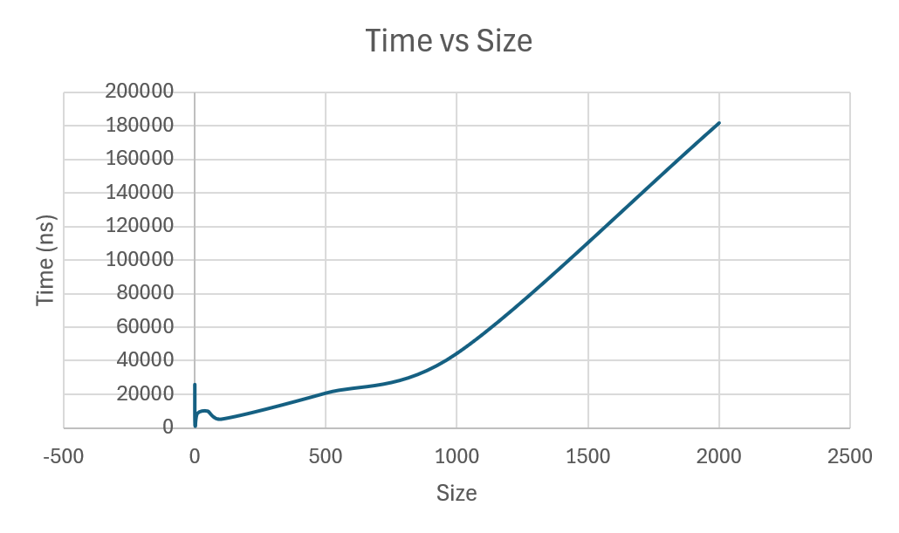
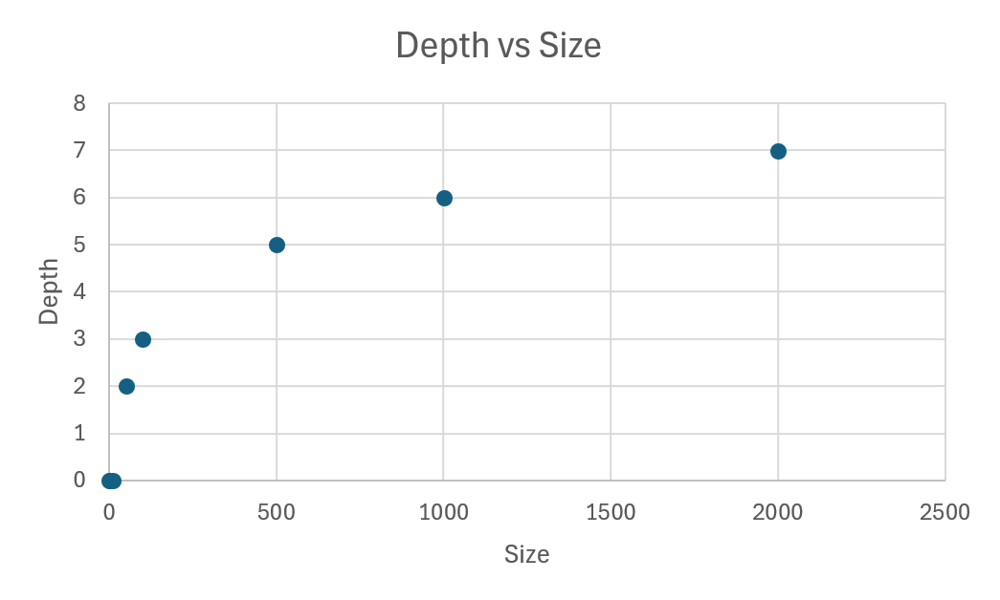
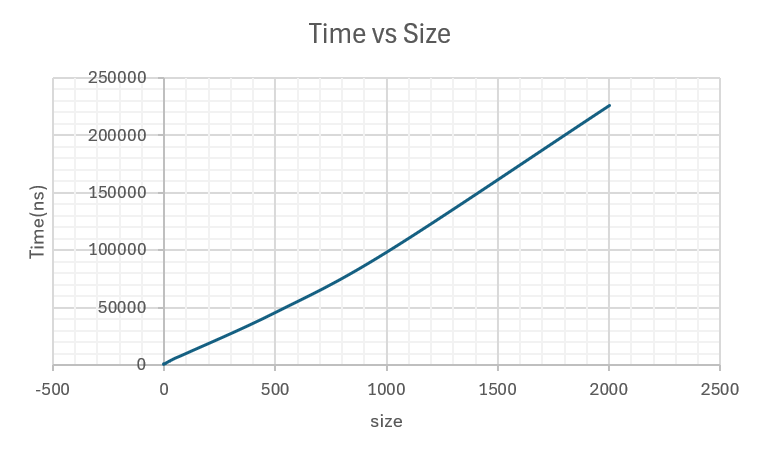
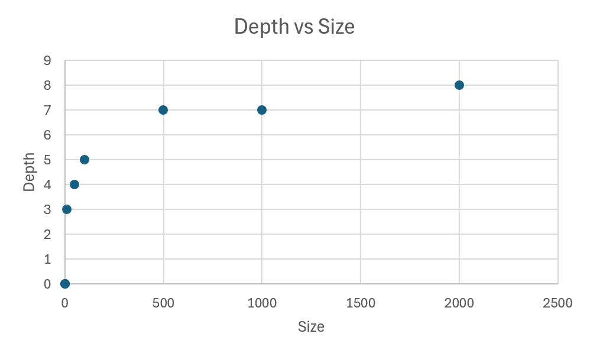
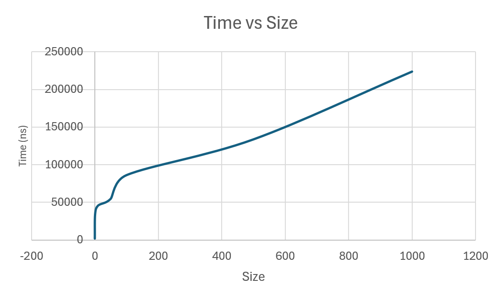
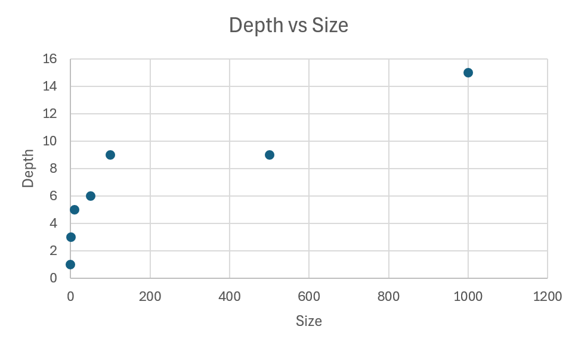
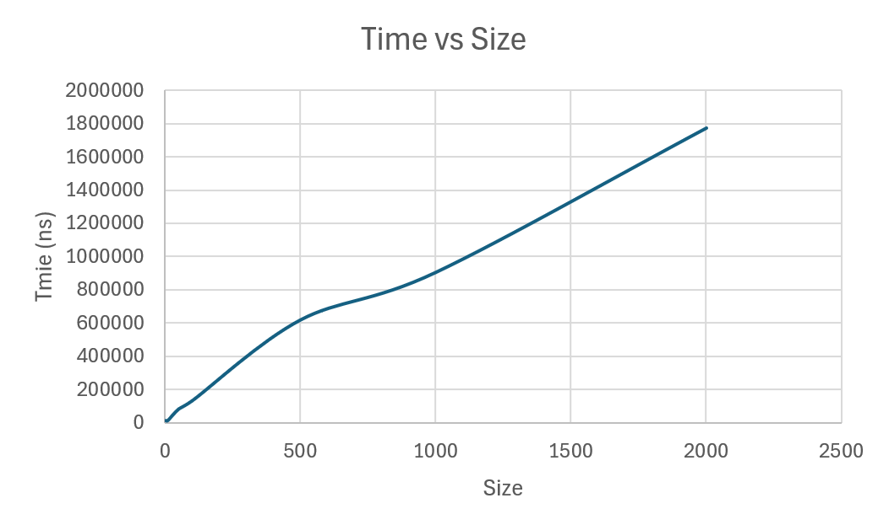
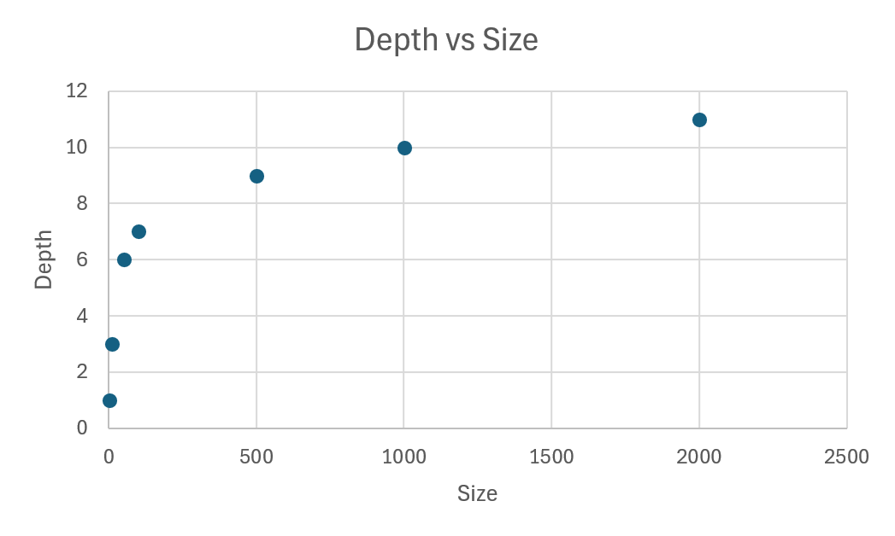

# **Divide-and-Conquer Algorithms Implementation and Performance Analysis**

## **Overview**
This project implements four classic divide-and-conquer algorithms in Java 17 and analyzes their performance:
1. **MergeSort**
2. **QuickSort**
3. **Deterministic Select (Median-of-Medians)**
4. **Closest Pair of Points (2D)**

Key features of the project:
- Safe recursion patterns
- Running-time analysis using Master Theorem and Akra-Bazzi intuition
- Metrics collection (time, recursion depth, comparisons, allocations)
- GitHub workflow for collaborative development

---

## **Learning Goals**
- Implement algorithms using divide-and-conquer approaches with safe recursion patterns.
- Analyze the running-time recurrences of each algorithm using the Master Theorem and Akra-Bazzi intuition.
- Collect and visualize key performance metrics like time, recursion depth, comparisons, and memory allocations.

---

## **Algorithms**

### **1. MergeSort**
- **Approach**: A divide-and-conquer algorithm that splits the array and merges it back using a linear merge process. A reusable buffer is employed for merging, and a small-n cut-off is used for efficiency (switching to insertion sort for small arrays).
- **Time Complexity**: O(n log n) based on the Master Theorem (Case 2).

### **2. QuickSort**
- **Approach**: QuickSort utilizes a randomized pivot to ensure good performance on all input arrays, even adversarial ones. The algorithm recurses on the smaller partition and iterates over the larger one.
- **Time Complexity**: O(n log n) on average.

### **3. Deterministic Select (Median-of-Medians)**
- **Approach**: This algorithm finds the k-th smallest element in O(n) time using the Median-of-Medians method, ensuring that recursion only happens on the relevant side.
- **Time Complexity**: O(n).

### **4. Closest Pair of Points (2D)**
- **Approach**: The algorithm finds the closest pair of points in a 2D plane using sorting by x-coordinate, recursively splitting the points, and checking the "strip" that crosses the boundary.
- **Time Complexity**: O(n log n).

---

## **Performance Metrics**
The following performance metrics are tracked during execution:
- **Execution Time**: Time taken to execute the algorithm on different input sizes.
- **Recursion Depth**: The maximum recursion depth observed during execution.
- **Number of Comparisons**: The number of comparisons made during the execution.
- **Memory Allocations**: The number of memory allocations performed.

These metrics are saved in CSV format for later analysis.

---

## **Plots and Visualizations**
Here, you can include plots for the time vs. input size (n), recursion depth vs. input size (n), and any other relevant graphs. These visualizations help in understanding the performance characteristics of the algorithms.

### MergeSort
- **Time vs. n Plot**
  
- **Recursion Depth vs. n Plot**
  

### QuickSort
- **Time vs. n Plot**
  
- **Recursion Depth vs. n Plot**
  

### Deterministic Select
- **Time vs. n Plot**
  
- **Recursion Depth vs. n Plot**
  

### Closest Pair of Points
- **Time vs. n Plot**
  
- **Recursion Depth vs. n Plot**
  

---

## **GitHub Workflow**

### **Branches**:
- **main**: Contains stable, working versions of the project.
- **feature/mergesort**: Implements the MergeSort algorithm.
- **feature/quicksort**: Implements the QuickSort algorithm.
- **feature/select**: Implements the Deterministic Select algorithm.
- **feature/closest**: Implements the Closest Pair of Points algorithm.

### **Commits**:
The project follows a structured commit message format:
- `init`: Project setup with Maven, JUnit5, and CI.
- `feat(metrics)`: Implemented metrics collection (time, recursion depth, comparisons, allocations).
- `feat(mergesort)`: MergeSort implementation with reusable buffer and small-n cut-off.
- `feat(quicksort)`: QuickSort implementation with randomized pivot.
- `feat(select)`: Deterministic Select implementation using Median-of-Medians.
- `feat(closest)`: Closest Pair of Points implementation using divide-and-conquer.
- `fix`: Bug fixes for edge cases like duplicates and tiny arrays.
- `release`: Final version (v1.0).

---

## **Testing**

Each algorithm has been tested for:
- **Correctness**: Validating results against known solutions (e.g., comparing Select to `Arrays.sort(a)[k]`).
- **Performance**: Ensuring recursion depth is bounded, and execution time aligns with the expected time complexity.

---

## **Conclusion**
The project successfully implements four classic divide-and-conquer algorithms, analyzes their running-time complexities, and collects performance metrics. The results confirm the theoretical time complexities and provide insights into the efficiency of each algorithm in various scenarios.